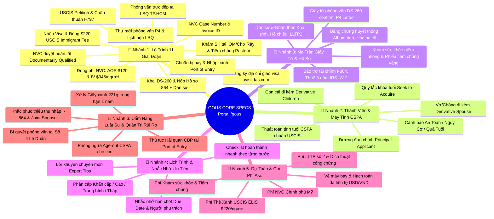

# GOUS CORE SPECS: Cổng Quản Lý Định Cư Hoa Kỳ Diện F4 (`/gous`)

> **Phiên bản:** 1.0.0  
> **Phân hệ:** Định cư Hoa Kỳ — Diện F4 (Anh/Chị/Em công dân Hoa Kỳ — INA § 203(a)(4))  
> **Mục tiêu:** Hệ thống trung tâm đồng hành, kiểm soát hồ sơ, thủ tục, giấy tờ, nhiệm vụ ưu tiên, chi phí và quản trị rủi ro pháp lý toàn diện từ lúc nhận hồ sơ tại NVC đến ngày đặt chân đến Hoa Kỳ.

---

## 1. Bản Đồ Tư Duy Hệ Thống (GoUS Mind Map Architecture)

---

## 2. Cây Tài Liệu Chi Tiết (Branch Documentation Tree)

Từ file trung tâm **`GOUS_CORE_SPECS.md`**, hệ thống phân nhánh thành 6 tài liệu đặc tả chuyên sâu:

- 📖 **Nhánh 1:** [Quy Trình 11 Giai Đoạn Di Trú (Pipeline & Stages Spec)](./pipeline-and-stages.md)
- 📖 **Nhánh 2:** [Thành Viên & Thuật Toán Tính Tuổi CSPA (Beneficiaries & CSPA Engine)](./cspa-and-members.md)
- 📖 **Nhánh 3:** [Ma Trận Danh Mục Hồ Sơ & Giấy Tờ (Documents Matrix Spec)](./documents-matrix.md)
- 📖 **Nhánh 4:** [Kế Hoạch Hành Động & Nhắc Nhở Ưu Tiên (Tasks & Reminders Spec)](./tasks-and-reminders.md)
- 📖 **Nhánh 5:** [Quản Lý Dự Toán & Chi Phí Định Cư F4 (Immigration Financials Spec)](./expenses-and-budget.md)
- 📖 **Nhánh 6:** [Cẩm Nang Luật Sư Di Trú & Quản Trị Rủi Ro (Legal Advisory & Risk Matrix)](./expert-advisory-and-risks.md)

---

## 3. Ma Trận Truy Xuất Nguồn Gốc 1:1 (Specs:Code Traceability Matrix)

Hệ thống cam kết tính toàn vẹn và ánh xạ **1:1 giữa Tài Liệu Đặc Tả và Mã Nguồn Thực Tế**:

| Phân Hệ Nghiệp Vụ | Tài Liệu Đặc Tả (Spec File) | Backend Entity / Service / Controller | Frontend API / Page / Component |
| :--- | :--- | :--- | :--- |
| **1. Case & Pipeline** | [`pipeline-and-stages.md`](./pipeline-and-stages.md) | • [`gous-case.entity.ts`](file:///d:/Hoa%20Hoang/Apps/family-management/server/src/common/entities/gous-case.entity.ts) • [`gous.service.ts`](file:///d:/Hoa%20Hoang/Apps/family-management/server/src/modules/gous/gous.service.ts) • [`gous.controller.ts`](file:///d:/Hoa%20Hoang/Apps/family-management/server/src/modules/gous/gous.controller.ts) | • [`api/gous.ts` (`getCase`, `updateCase`)](file:///d:/Hoa%20Hoang/Apps/family-management/web/src/api/gous.ts) • [`GoUsPortal.tsx` (`OverviewTab`, `STAGES`)](file:///d:/Hoa%20Hoang/Apps/family-management/web/src/pages/GoUsPortal.tsx) |
| **2. Members & CSPA** | [`cspa-and-members.md`](./cspa-and-members.md) | • [`gous-member.entity.ts`](file:///d:/Hoa%20Hoang/Apps/family-management/server/src/common/entities/gous-member.entity.ts) • [`gous.service.ts` (`calculateCspa`)](file:///d:/Hoa%20Hoang/Apps/family-management/server/src/modules/gous/gous.service.ts) • [`dto/cspa.dto.ts`](file:///d:/Hoa%20Hoang/Apps/family-management/server/src/modules/gous/dto/cspa.dto.ts) | • [`api/gous.ts` (`calculateCspa`)](file:///d:/Hoa%20Hoang/Apps/family-management/web/src/api/gous.ts) • [`GoUsPortal.tsx` (`MembersTab`, `CspaModal`)](file:///d:/Hoa%20Hoang/Apps/family-management/web/src/pages/GoUsPortal.tsx) |
| **3. Documents Matrix** | [`documents-matrix.md`](./documents-matrix.md) | • [`gous-document.entity.ts`](file:///d:/Hoa%20Hoang/Apps/family-management/server/src/common/entities/gous-document.entity.ts) • [`gous.service.ts` (`seedDefaultF4Roadmap`)](file:///d:/Hoa%20Hoang/Apps/family-management/server/src/modules/gous/gous.service.ts) | • [`api/gous.ts` (`getDocuments`, `addDocument`)](file:///d:/Hoa%20Hoang/Apps/family-management/web/src/api/gous.ts) • [`GoUsPortal.tsx` (`DocumentsTab`, `DocModal`)](file:///d:/Hoa%20Hoang/Apps/family-management/web/src/pages/GoUsPortal.tsx) |
| **4. Tasks & Reminders** | [`tasks-and-reminders.md`](./tasks-and-reminders.md) | • [`gous-task.entity.ts`](file:///d:/Hoa%20Hoang/Apps/family-management/server/src/common/entities/gous-task.entity.ts) • [`dto/task.dto.ts`](file:///d:/Hoa%20Hoang/Apps/family-management/server/src/modules/gous/dto/task.dto.ts) | • [`api/gous.ts` (`getTasks`, `updateTask`)](file:///d:/Hoa%20Hoang/Apps/family-management/web/src/api/gous.ts) • [`GoUsPortal.tsx` (`TasksTab`, `TaskModal`)](file:///d:/Hoa%20Hoang/Apps/family-management/web/src/pages/GoUsPortal.tsx) |
| **5. Expenses & Budget** | [`expenses-and-budget.md`](./expenses-and-budget.md) | • [`gous-expense.entity.ts`](file:///d:/Hoa%20Hoang/Apps/family-management/server/src/common/entities/gous-expense.entity.ts) • [`dto/expense.dto.ts`](file:///d:/Hoa%20Hoang/Apps/family-management/server/src/modules/gous/dto/expense.dto.ts) | • [`api/gous.ts` (`getExpenses`, `addExpense`)](file:///d:/Hoa%20Hoang/Apps/family-management/web/src/api/gous.ts) • [`GoUsPortal.tsx` (`ExpensesTab`, `ExpenseModal`)](file:///d:/Hoa%20Hoang/Apps/family-management/web/src/pages/GoUsPortal.tsx) |
| **6. Legal Advisory** | [`expert-advisory-and-risks.md`](./expert-advisory-and-risks.md) | • [`gous.service.ts`](file:///d:/Hoa%20Hoang/Apps/family-management/server/src/modules/gous/gous.service.ts) • Khởi tạo sẵn các tips nghiệp vụ | • [`GoUsPortal.tsx` (`ExpertGuidelinesTab`)](file:///d:/Hoa%20Hoang/Apps/family-management/web/src/pages/GoUsPortal.tsx) |

---

## 4. Mô Hình Thuê Bao Gia Đình (Multi-Family Tenancy Model)

- **1 Gia Đình = 1 Hồ Sơ F4 Duy Nhất (`familyId` Unique):** Dữ liệu hồ sơ định cư được cách ly hoàn toàn theo phiên làm việc gia đình (`familyId`).
- **Phân quyền RBAC:** Cả `FAMILY_ADMIN` và `MEMBER` trong gia đình đều có quyền truy cập, xem và cập nhật tiến trình hồ sơ của gia đình mình.
- **Tiêu chuẩn UI:** Không bao giờ hiển thị thông tin kỹ thuật nội bộ (UUIDs, ID cơ sở dữ liệu, raw errors) trên màn hình người dùng.
