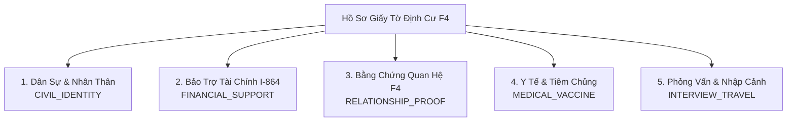

# Ma Trận Danh Mục Hồ Sơ & Giấy Tờ (Documents Matrix Spec)

Tài liệu đặc tả toàn bộ danh mục giấy tờ dân sự, bảo trợ tài chính, bằng chứng quan hệ huyết thống, khám sức khỏe và giấy tờ phỏng vấn diện F4 theo chuẩn NVC và Lãnh sự quán Hoa Kỳ tại TP.HCM.

---

## 1. Phân Nhóm Danh Mục Giấy Tờ (Document Categories)



---

## 2. Chi Tiết Từng Nhóm Giấy Tờ & Quy Chuẩn Pháp Lý

### 2.1 Nhóm 1: Dân Sự & Nhân Thân (`CIVIL_IDENTITY`)
1. **Bản chính Giấy khai sinh (Trích lục hộ tịch):**
   - Cần bản trích lục hộ tịch mẫu mới nhất từ UBND xã/phường/huyện.
   - Bắt buộc kiểm tra độ trùng khớp họ tên cha mẹ giữa người bảo lãnh (Petitioner) và người được bảo lãnh chính (Principal Applicant).
2. **Hộ chiếu phổ thông (Passport):**
   - Từng thành viên trong gia đình phải có hộ chiếu riêng (bao gồm trẻ sơ sinh và trẻ nhỏ).
   - Hộ chiếu phải còn hạn **ít nhất 6 tháng** tính từ ngày dự kiến nhập cảnh Mỹ.
3. **Phiếu Lý lịch tư pháp số 2 (Police Certificate):**
   - Bắt buộc đối với tất cả đương đơn từ **đủ 16 tuổi trở lên**.
   - Cấp bởi Sở Tư pháp tỉnh/thành phố hoặc qua cổng Dịch vụ công Quốc gia / ứng dụng VNeID.
   - *Thời hạn hiệu lực theo quy định LSQ:* Thường có giá trị trong vòng **1 đến 2 năm**. Khuyến nghị làm lại bản mới trước ngày phỏng vấn khoảng 1 - 2 tháng.
4. **Giấy chứng nhận kết hôn / Quyết định ly hôn (Nếu có):**
   - Chứng minh quan hệ vợ chồng hợp pháp của đương đơn chính hoặc người bảo lãnh.

---

### 2.2 Nhóm 2: Bảo Trợ Tài Chính I-864 (`FINANCIAL_SUPPORT`)
1. **Form I-864 (Affidavit of Support Under Section 213A of the INA):**
   - Điền đầy đủ, chính xác quy mô gia đình (Household size) và có chữ ký tay của Người bảo lãnh tại Mỹ.
2. **Bản khai thuế IRS (Tax Transcripts) & W-2 (3 năm gần nhất):**
   - Tải bản *Tax Return Transcript* chính thức từ website `irs.gov`.
   - Thuế của năm gần nhất là **bắt buộc**.
3. **Thư xác nhận việc làm & Cuống lương (Pay stubs):**
   - Employment Verification Letter ghi rõ chức danh, ngày bắt đầu làm việc, mức lương hiện tại.
   - Cuống lương 3 - 6 tháng gần nhất.
4. **Hồ sơ Người đồng bảo trợ (Joint Sponsor - Nếu thu nhập người bảo lãnh không đủ):**
   - Form I-864 riêng của người đồng bảo trợ + Bằng chứng tư cách (Hộ chiếu Mỹ / Khai sinh Mỹ / Thẻ xanh) + Tax Transcripts 3 năm + Giấy tờ việc làm.
   - Nếu dùng thu nhập của người sống chung nhà: nộp kèm Form I-864A (Contract Between Sponsor and Household Member).

---

### 2.3 Nhóm 3: Bằng Chứng Quan Hệ Huyết Thống F4 (`RELATIONSHIP_PROOF`)
1. **Album ảnh gia đình qua các mốc thời gian:**
   - Ảnh chụp chung giữa người bảo lãnh và người được bảo lãnh từ thời niên thiếu, lễ tết, họp mặt gia đình, đám cưới, các chuyến về thăm Việt Nam của người bảo lãnh.
   - In màu, ghi chú rõ mốc thời gian (năm chụp), địa điểm và những người trong ảnh.
2. **Hộ khẩu cũ / Học bạ xưa / Sổ gia đình trước năm 1975:**
   - Chứng minh việc sống chung nhà và có chung cha mẹ từ nhỏ.
3. **Kết quả xét nghiệm ADN (DNA Testing - Nếu Lãnh sự yêu cầu):**
   - Chỉ thực hiện tại phòng lab được Hiệp hội Ngân hàng Máu Hoa Kỳ (AABB) chỉ định khi nhận được thư yêu cầu từ Lãnh sự quán.

---

### 2.4 Nhóm 4: Y Tế & Tiêm Chủng (`MEDICAL_VACCINE`)
1. **Hồ sơ Khám sức khỏe xuất cảnh:**
   - Khám tại IOM hoặc BV Chợ Rẫy (gồm chụp X-quang phổi, xét nghiệm máu giang mai/lậu, khám lâm sàng).
   - Kết quả được chuyển điện tử (eMedical) sang Lãnh sự quán hoặc giao túi niêm phong (tuyệt đối không mở).
2. **Phiếu tiêm chủng quốc tế (International Certificate of Vaccination - Màu vàng):**
   - Cấp bởi Viện Pasteur TP.HCM hoặc Trung tâm Kiểm dịch Y tế Quốc tế.
   - Mang theo phiếu tiêm chủng khi đi phỏng vấn và khi nhập cảnh Mỹ.

---

### 2.5 Nhóm 5: Phỏng Vấn & Nhập Cảnh (`INTERVIEW_TRAVEL`)
1. **Trang xác nhận DS-260 (Confirmation Page):** Có mã vạch cho từng người.
2. **Thư mời phỏng vấn P4:** Bản in rõ nét.
3. **Giấy đăng ký địa chỉ phát chuyển Visa (uvisitdas.com).**
4. **Biên lai nộp phí thẻ xanh USCIS ($220/người):** In xác nhận nộp phí ELIS.

---

## 3. Vòng Đời Trạng Thái Giấy Tờ (Document Status Lifecycle)

```text
NOT_PREPARED (Chưa chuẩn bị)
    -> ORIGINAL_OBTAINED (Đã có bản chính)
        -> TRANSLATED_NOTARIZED (Đã dịch thuật công chứng)
            -> SUBMITTED_NVC (Đã nộp lên CEAC)
                -> READY_FOR_INTERVIEW (Đã sẵn sàng mang đi phỏng vấn)
                    -> [Nếu quá hạn] -> EXPIRED (Đã hết hạn -> Cần làm lại)
```

---

## 4. Liên Kết Mã Nguồn (Specs:Code 1:1 Mapping)

| Thành Phần Đặc Tả | Backend Source File | Frontend Source File |
| :--- | :--- | :--- |
| **Entity GoUsDocument** | [`gous-document.entity.ts`](file:///d:/Hoa%20Hoang/Apps/family-management/server/src/common/entities/gous-document.entity.ts) | [`api/gous.ts`](file:///d:/Hoa%20Hoang/Apps/family-management/web/src/api/gous.ts#L47-L61) |
| **Danh mục khởi tạo mẫu** | [`gous.service.ts` (`seedDefaultF4Roadmap`)](file:///d:/Hoa%20Hoang/Apps/family-management/server/src/modules/gous/gous.service.ts#L330-L420) | [`GoUsPortal.tsx` (DocumentsTab)](file:///d:/Hoa%20Hoang/Apps/family-management/web/src/pages/GoUsPortal.tsx#L1520-L1620) |
| **CRUD Document API** | [`gous.controller.ts` (`/gous/documents`)](file:///d:/Hoa%20Hoang/Apps/family-management/server/src/modules/gous/gous.controller.ts#L65-L85) | [`GoUsPortal.tsx` (DocModal & Mutation)](file:///d:/Hoa%20Hoang/Apps/family-management/web/src/pages/GoUsPortal.tsx#L180-L195) |
