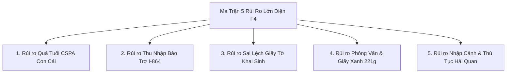

# Cẩm Nang Luật Sư Di Trú & Quản Trị Rủi Ro F4 (Legal Advisory & Risk Matrix Spec)

Tài liệu đặc tả toàn diện 5 trụ cột kiến thức chuyên sâu của luật sư di trú Hoa Kỳ, các rủi ro pháp lý phổ biến diện F4, hướng dẫn xử lý Giấy xanh 221(g) và cẩm nang chuẩn bị nhập cảnh (Port of Entry).

---

## 1. Ma Trận 5 Rủi Ro Pháp Lý Trọng Yếu Diện F4

---

## 2. Chi Tiết 5 Trụ Cột Cố Vấn Chuyên Sâu

### Trụ Cột 1: Rủi Ro Tuổi CSPA Của Con Cái (Age-Out)
- **Vấn đề:** Thời gian chờ F4 kéo dài (12 - 16 năm). Trẻ em từ lúc nộp hồ sơ (3-7 tuổi) khi đến lượt phỏng vấn thường đã 19 - 23 tuổi.
- **Biện pháp phòng ngừa:**
  1. Tính toán tuổi CSPA sớm bằng công cụ trong hệ thống.
  2. Nộp đơn DS-260 và đóng phí IV ngay khi có thể để đáp ứng quy tắc *Seek to Acquire*.
  3. Nhắc nhở con cái **tuyệt đối không đăng ký kết hôn** trước khi đặt chân đến Mỹ.

---

### Trụ Cột 2: Rủi Ro Bảo Trợ Tài Chính I-864
- **Vấn đề:** Thu nhập của người bảo lãnh bên Mỹ không đủ vượt 125% chuẩn nghèo theo quy mô hộ gia đình mở rộng (Household size).
- **Biện pháp phòng ngừa:**
  1. Tính đúng quy mô gia đình: Số người phụ thuộc bên Mỹ + Tổng số thành viên gia đình F4.
  2. Tìm kiếm **Người đồng bảo trợ (Joint Sponsor)** đáp ứng đủ điều kiện thu nhập độc lập trước khi nộp NVC.
  3. Lấy bản *Tax Return Transcript* chính thức từ IRS thay vì bản 1040 tự nộp.

---

### Trụ Cột 3: Rủi Ro Chứng Minh Quan Hệ Anh/Chị/Em Ruột
- **Vấn đề:** Khai sinh bị thất lạc, làm lại muộn, sai lệch họ tên lót của cha mẹ, hoặc anh/chị/em cùng cha khác mẹ / cùng mẹ khác cha.
- **Biện pháp phòng ngừa:**
  1. Trích lục khai sinh từ sổ gốc hộ tịch tại UBND.
  2. Chuẩn bị album ảnh gia đình qua nhiều mốc thời gian (từ nhỏ đến lớn).
  3. Giữ sổ hộ khẩu cũ, học bạ cũ, giấy tờ cha mẹ trước năm 1975.
  4. Sẵn sàng xét nghiệm ADN tại cơ sở chỉ định nếu có yêu cầu.

---

### Trụ Cột 4: Bí Quyết Phỏng Vấn & Xử Lý Giấy Xanh 221(g)
- **Vấn đề:** Bị viên chức cấp Giấy xanh 221(g) tạm dừng hồ sơ do thiếu giấy tờ hoặc nghi ngờ thông tin.
- **Biện pháp phòng ngừa & Xử lý:**
  1. Nắm chắc thông tin người bảo lãnh: Năm sang Mỹ, diện sang Mỹ, tiểu bang đang sống, công việc, tình trạng gia đình, lần về VN gần nhất.
  2. Giữ thái độ tự tin, trả lời ngắn gọn, trung thực, trùng khớp với đơn DS-260.
  3. Nếu nhận Giấy xanh 221(g): Bổ sung đúng danh mục yêu cầu trong thời hạn **1 năm** (quá 1 năm hồ sơ sẽ bị hủy theo điều khoản INA 203(g)).

---

### Trụ Cột 5: Chuẩn Bị Bay & Thủ Tục Nhập Cảnh (Port of Entry)
- **Vấn đề:** Bị giữ lại tại sân bay đầu tiên của Mỹ (POE) do mang hàng cấm hoặc hồ sơ niêm phong bị rách.
- **Quy tắc bắt buộc:**
  1. **Đóng phí thẻ xanh USCIS $220/người** trước khi bay.
  2. **Túi hồ sơ niêm phong màu nâu:** TUYỆT ĐỐI KHÔNG TỰ Ý BÓC MỞ.
  3. **Tiền mặt mang theo:** Khai báo hải quan mẫu FinCEN 105 nếu mang tổng tiền mặt từ $10,000 trở lên.
  4. **An sinh xã hội & Y tế:** Chuẩn bị địa chỉ chính xác để nhận thẻ SSN và Thẻ Xanh sau khi nhập cảnh.

---

## 3. Liên Kết Mã Nguồn (Specs:Code 1:1 Mapping)

| Thành Phần Đặc Tả | Frontend Component / Page | Backend Service Logic |
| :--- | :--- | :--- |
| **Cẩm nang 5 trụ cột UI** | [`GoUsPortal.tsx` (`ExpertGuidelinesTab`)](file:///d:/Hoa%20Hoang/Apps/family-management/web/src/pages/GoUsPortal.tsx#L1825-L1995) | Khởi tạo dữ liệu và kinh nghiệm tại [`gous.service.ts`](file:///d:/Hoa%20Hoang/Apps/family-management/server/src/modules/gous/gous.service.ts) |
