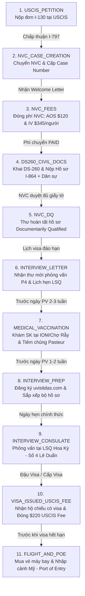

# Quy Trình 11 Giai Đoạn Định Cư Mỹ Diện F4 (Pipeline & Stages Spec)

Tài liệu đặc tả chi tiết 11 giai đoạn nghiệp vụ di trú diện F4 (Anh/Chị/Em ruột của công dân Mỹ), các mốc thời gian, điều kiện tiên quyết, quy tắc chuyển trạng thái và liên kết 1:1 với mã nguồn.

---

## 1. Bản Đồ 11 Giai Đoạn Di Trú (Pipeline Workflow)

---

## 2. Chi Tiết Từng Giai Đoạn & Quy Tắc Nghiệp Vụ

### Giai đoạn 1: `USCIS_PETITION` — Nộp đơn I-130 tại USCIS
- **Cơ quan thụ lý:** Sở Di trú và Nhập tịch Hoa Kỳ (USCIS).
- **Hồ sơ:** Đơn I-130 (Petition for Alien Relative) do công dân Mỹ (Petitioner) nộp cho anh/chị/em ruột (Principal Applicant).
- **Mốc quan trọng:**
  - *Ngày ưu tiên (Priority Date - PD):* Ngày USCIS đóng dấu nhận đơn I-130. Đây là ngày giữ chỗ quyết định thứ tự xét duyệt visa sau này.
  - *Ngày chấp thuận (Approval Date):* Ngày USCIS phát hành Form I-797 (Notice of Action) chấp thuận đơn.
- **Quy tắc Code:** Khoảng thời gian `Approval Date - Priority Date` chính là thời gian chờ duyệt (I-130 Pending Time), dùng trực tiếp để trừ tuổi trong Đạo luật CSPA.

---

### Giai đoạn 2: `NVC_CASE_CREATION` — Chuyển NVC & Cấp Mã Hồ Sơ
- **Cơ quan thụ lý:** Trung tâm Thị thực Quốc gia (National Visa Center - NVC, Portsmouth, NH).
- **Đầu ra:** Thư thông báo mở hồ sơ (NVC Welcome Letter) chứa 2 thông tin bảo mật:
  1. *Mã hồ sơ NVC (Case Number):* Ví dụ `HCM2010xxxxxx` (HCM đại diện cho LSQ TP.HCM, tiếp theo là năm tạo case).
  2. *Mã hóa đơn (Invoice Identification Number - Invoice ID).*
- **Quy tắc Code:** Entity `GoUsCase` lưu `caseNumber` và `invoiceId` phục vụ tra cứu trên cổng CEAC.

---

### Giai đoạn 3: `NVC_FEES` — Mở Hồ Sơ & Đóng Phí NVC
- **Cổng thanh toán:** CEAC (Consular Electronic Application Center - ceac.state.gov).
- **Các khoản phí:**
  - *Phí xét duyệt hồ sơ bảo trợ tài chính (Affidavit of Support Fee - AOS):* **$120** (Đóng 1 lần cho cả bộ hồ sơ).
  - *Phí xử lý đơn xin thị thực di dân (Immigrant Visa Application Processing Fee - IV Fee):* **$345 / người** (Nhân với tổng số người trong gia đình).
- **Điều kiện tiên quyết:** Phải thanh toán bằng tài khoản ngân hàng nội địa Mỹ (Routing Number + Account Number).
- **Thời gian xử lý:** Mất từ 2 - 5 ngày làm việc để trạng thái chuyển từ `In Process` sang `PAID`.

---

### Giai đoạn 4: `DS260_CIVIL_DOCS` — Khai Đơn DS-260 & Nộp Bộ Hồ Sơ
- **1. Khai đơn trực tuyến DS-260:**
  - Từng thành viên trong gia đình phải khai một đơn DS-260 riêng biệt.
  - Sau khi submit, hệ thống cấp Trang xác nhận DS-260 (DS-260 Confirmation Page) có mã vạch `AA00xxxxxx`.
- **2. Nộp Bộ Bảo trợ Tài chính (I-864):**
  - Form I-864 có chữ ký tay của Người bảo lãnh bên Mỹ.
  - IRS Tax Transcripts 3 năm gần nhất + Mẫu W-2.
  - Thư xác nhận việc làm (Employment Verification Letter) + Cuống lương 3-6 tháng.
  - Nếu thiếu thu nhập: Nộp kèm Form I-864 / I-864A của Người đồng bảo trợ (Joint Sponsor).
- **3. Nộp Bộ Giấy tờ Dân sự điện tử (Civil Documents):**
  - Khai sinh trích lục, Đăng ký kết hôn, Hộ chiếu, Lý lịch tư pháp số 2.
  - File scan định dạng PDF/JPG, dung lượng < 2MB/file.

---

### Giai đoạn 5: `NVC_DQ` — Hoàn Tất Xét Duyệt (Documentarily Qualified)
- NVC xem xét toàn bộ đơn DS-260 và các bản scan giấy tờ.
- Nếu đạt chuẩn, NVC gửi email xác nhận: **"Notice of Immigrant Visa Case Creation / Documentarily Qualified" (Thư DQ)**.
- Hồ sơ chính thức xếp hàng chờ Lãnh sự quán Hoa Kỳ tại TP.HCM xếp lịch phỏng vấn dựa theo Lịch chiếu khán (Visa Bulletin).

---

### Giai đoạn 6: `INTERVIEW_LETTER` — Thư Mời Phỏng Vấn (P4 Letter)
- Lãnh sự quán xếp lịch và NVC gửi email **Thư mời phỏng vấn (P4 Letter)**.
- Thư mời ghi rõ: Ngày, giờ phỏng vấn, địa điểm (Số 4 Lê Duẩn, Q1, TP.HCM), danh sách tất cả các đương đơn được mời.
- **Quy tắc Code:** Cập nhật `interviewDate` trên `GoUsCase` để kích hoạt bộ đếm ngược và lịch nhắc nhở khám SK.

---

### Giai đoạn 7: `MEDICAL_VACCINATION` — Khám Sức Khỏe & Tiêm Chủng
- **Địa điểm Khám Sức Khỏe chỉ định:**
  - *Tổ chức Di dân Quốc tế (IOM):* 1B Phạm Ngọc Thạch, Q1, TP.HCM.
  - *Bệnh viện Chợ Rẫy (Khoa Khám Xuất Cảnh):* 201B Nguyễn Chí Thanh, Q5, TP.HCM.
- **Địa điểm Tiêm Chủng chỉ định:**
  - *Trung tâm Kiểm dịch Y tế Quốc tế:* 40 Nguyễn Văn Trỗi, Q. Phú Nhuận, TP.HCM.
  - *Viện Pasteur TP.HCM:* 167 Pasteur, Q3, TP.HCM.
- **Lưu ý Pháp lý:** Kết quả khám sức khỏe có giá trị **tối đa 6 tháng**. Thời hạn của Visa cấp ra sẽ trùng với ngày hết hạn của kết quả khám sức khỏe!

---

### Giai đoạn 8: `INTERVIEW_PREP` — Chuẩn Bị Bộ Hồ Sơ Phỏng Vấn
- Đăng ký địa chỉ giao nhận Hộ chiếu / Visa trên website chỉ định (`uvisitdas.com`).
- In tờ xác nhận đăng ký địa chỉ bưu điện (Address Registration Confirmation).
- Sắp xếp hồ sơ thành 3 bộ riêng biệt:
  1. *Bộ Bản chính (Originals):* Mang đi đối chiếu tại quầy sơ vấn.
  2. *Bộ Bản dịch công chứng tiếng Anh:* Nộp cho Lãnh sự lưu hồ sơ.
  3. *Bộ Bằng chứng quan hệ huyết thống:* Album ảnh gia đình, học bạ cũ, hộ khẩu xưa.

---

### Giai đoạn 9: `INTERVIEW_CONSULATE` — Phỏng Vấn Tại LSQ Hoa Kỳ (TP.HCM)
- **Địa điểm:** Lãnh sự quán Hoa Kỳ, Số 4 Lê Duẩn, Phường Bến Nghé, Quận 1, TP.HCM.
- **Quy trình ngày phỏng vấn:**
  1. Qua cửa an ninh & Quét mã vạch thư mời P4.
  2. Lấy số thứ tự tại quầy tiếp tân.
  3. Quầy sơ vấn: Nộp giấy tờ, chụp hình và lấy dấu vân tay 10 ngón.
  4. Quầy phỏng vấn chính thức: Viên chức Lãnh sự quán Hoa Kỳ phỏng vấn trực tiếp.
- **Kết quả phỏng vấn:**
  - *Chấp thuận (Approved / Issued):* Viên chức giữ lại Hộ chiếu và cấp giấy hẹn nhận visa qua đường bưu điện sau 1-2 tuần.
  - *Giấy xanh 221(g) (Pending):* Yêu cầu bổ sung thêm giấy tờ (Lý lịch tư pháp mới, thuế năm gần nhất, thử ADN...).

---

### Giai đoạn 10: `VISA_ISSUED_USCIS_FEE` — Nhận Visa & Đóng Phí Thẻ Xanh
- Nhận hộ chiếu có dán Visa định cư (Immigrant Visa) kèm gói hồ sơ niêm phong (nếu không dùng hồ sơ điện tử).
- **Đóng phí thẻ xanh (USCIS Immigrant Fee):**
  - Mức phí: **$220 / người**.
  - Đóng trực tuyến trên cổng USCIS ELIS (`my.uscis.gov/uscis-immigrant-fee`).
  - Phải đóng phí này trước khi bay để Thẻ Xanh (Green Card) được in và gửi về địa chỉ Mỹ sau 3-8 tuần kể từ ngày nhập cảnh.

---

### Giai đoạn 11: `FLIGHT_AND_POE` — Chuẩn Bị Bay & Nhập Cảnh (Port of Entry)
- Mua vé máy bay 1 chiều sang Mỹ (bay trước ngày visa hết hạn).
- Khai báo hải quan nếu mang tiền mặt trên $10,000 / gia đình.
- Nhập cảnh tại sân bay đầu tiên của Mỹ (Port of Entry - POE):
  - Xuất trình hộ chiếu có visa + Gói niêm phong của Lãnh sự (nếu có).
  - Viên chức Hải quan CBP đóng dấu mộc I-551 (Thẻ xanh tạm 1 năm) vào hộ chiếu.
  - Chính thức trở thành Thường Trú Nhân Hợp Pháp (LPR) của Hợp chủng quốc Hoa Kỳ.

---

## 3. Liên Kết Mã Nguồn (Specs:Code 1:1 Mapping)

| Mục Đặc Tả | Backend Source File | Frontend Source File |
| :--- | :--- | :--- |
| **Enum GoUsStage** | [`gous-case.entity.ts`](file:///d:/Hoa%20Hoang/Apps/family-management/server/src/common/entities/gous-case.entity.ts#L8-L20) | [`api/gous.ts`](file:///d:/Hoa%20Hoang/Apps/family-management/web/src/api/gous.ts#L3-L15) |
| **Lộ trình UI (STAGES array)** | [`gous.service.ts`](file:///d:/Hoa%20Hoang/Apps/family-management/server/src/modules/gous/gous.service.ts#L400-L550) | [`GoUsPortal.tsx`](file:///d:/Hoa%20Hoang/Apps/family-management/web/src/pages/GoUsPortal.tsx#L55-L68) |
| **Cập nhật giai đoạn API** | [`gous.controller.ts`](file:///d:/Hoa%20Hoang/Apps/family-management/server/src/modules/gous/gous.controller.ts#L32-L36) | [`GoUsPortal.tsx`](file:///d:/Hoa%20Hoang/Apps/family-management/web/src/pages/GoUsPortal.tsx#L125-L135) |
