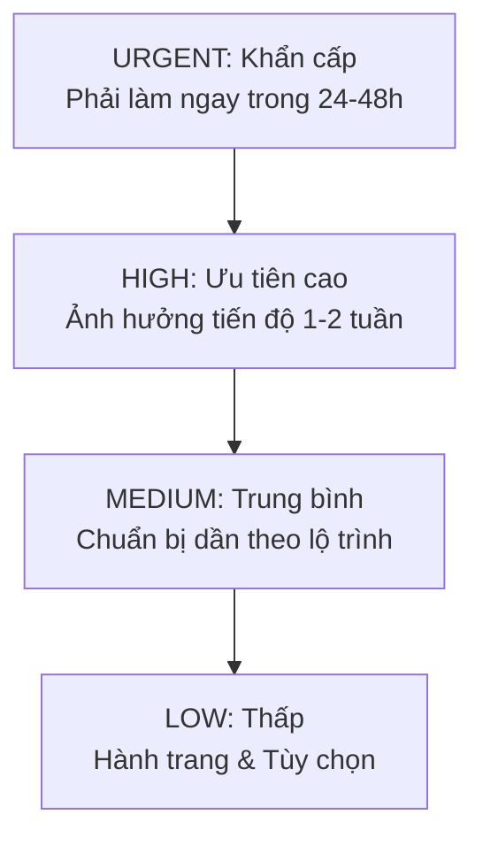

# Kế Hoạch Hành Động & Nhắc Nhở Ưu Tiên (Tasks & Reminders Spec)

Tài liệu đặc tả hệ thống quản lý công việc, phân cấp mức độ ưu tiên, lịch trình nhắc nhở theo từng giai đoạn và lời khuyên nghiệp vụ (Expert Tips) đi kèm.

---

## 1. Phân Cấp Mức Độ Ưu Tiên (Task Priority Hierarchy)



### Tiêu Chuẩn Phân Loại:
- **`URGENT` (Khẩn cấp):**
  - Đóng phí IV & Nộp đơn DS-260 để khóa tuổi CSPA cho con sắp 21 tuổi.
  - Đăng ký địa chỉ chuyển phát visa trên `uvisitdas.com`.
  - Tham gia phỏng vấn đúng ngày giờ tại LSQ.
- **`HIGH` (Ưu tiên cao):**
  - Làm Lý lịch tư pháp số 2 (trước phỏng vấn 1-2 tháng).
  - Đặt lịch khám sức khỏe xuất cảnh và tiêm ngừa vắc xin.
  - Chuẩn bị đầy đủ bộ thuế I-864 của người bảo lãnh/đồng bảo trợ.
- **`MEDIUM` (Trung bình):**
  - Rà soát lại bản dịch thuật công chứng các giấy tờ dân sự.
  - Tập hợp album ảnh bằng chứng quan hệ gia đình.
- **`LOW` (Thấp):**
  - Tham khảo các gói cước viễn thông, bảo hiểm du lịch trước ngày bay.

---

## 2. Vòng Đời Trạng Thái Công Việc (Task Status)

```text
TODO (Chưa làm) ---> IN_PROGRESS (Đang thực hiện) ---> DONE (Đã hoàn thành)
                 \
                  ---> SKIPPED (Bỏ qua / Không áp dụng)
```

---

## 3. Liên Kết Mã Nguồn (Specs:Code 1:1 Mapping)

| Thành Phần Đặc Tả | Backend Source File | Frontend Source File |
| :--- | :--- | :--- |
| **Entity GoUsTask** | [`gous-task.entity.ts`](file:///d:/Hoa%20Hoang/Apps/family-management/server/src/common/entities/gous-task.entity.ts) | [`api/gous.ts`](file:///d:/Hoa%20Hoang/Apps/family-management/web/src/api/gous.ts#L63-L75) |
| **Gợi ý nhiệm vụ chuẩn theo 11 giai đoạn** | [`gous.service.ts` (`seedDefaultF4Roadmap`)](file:///d:/Hoa%20Hoang/Apps/family-management/server/src/modules/gous/gous.service.ts#L425-L530) | [`GoUsPortal.tsx` (TasksTab)](file:///d:/Hoa%20Hoang/Apps/family-management/web/src/pages/GoUsPortal.tsx#L1625-L1720) |
| **CRUD Task & Toggle Done API** | [`gous.controller.ts` (`/gous/tasks`)](file:///d:/Hoa%20Hoang/Apps/family-management/server/src/modules/gous/gous.controller.ts#L90-L115) | [`GoUsPortal.tsx` (`onToggleTask`, `TaskModal`)](file:///d:/Hoa%20Hoang/Apps/family-management/web/src/pages/GoUsPortal.tsx#L215-L225) |
